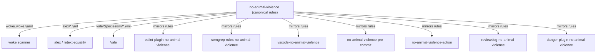

# no-animal-violence

[](https://github.com/Open-Paws/no-animal-violence/actions/workflows/ci.yml)
[](https://github.com/Open-Paws/no-animal-violence/blob/main/LICENSE)
[](https://github.com/Open-Paws/no-animal-violence/commits/main)

## TL;DR

`no-animal-violence` is the canonical pattern dictionary for detecting speciesist language in code, documentation, and configuration. It defines 65+ detection rules across four categories — violent animal idioms, animal-as-object metaphors, speciesist technical terminology, and industry euphemisms — with precise alternatives for each. Eight downstream tool adapters (ESLint, Semgrep, Vale, VS Code, pre-commit, GitHub Action, reviewdog, Danger.js) consume these rules in their native formats. Changes made here propagate to all eight tools.

> [!NOTE]
> This project is part of the [Open Paws](https://openpaws.ai) ecosystem — AI infrastructure for the animal liberation movement. [Explore the full platform →](https://github.com/Open-Paws)

Language shapes moral perception. Peer-reviewed research confirms that speciesist idioms and industry euphemisms in AI training data suppress moral concern for animals at a statistically significant level. This toolchain embeds animal welfare standards directly into the development process so that every developer who installs an adapter encounters an alternative framing — and a reason for it — each time a flagged phrase appears.

## Quickstart

**CI gate** — add to `.github/workflows/inclusive-language.yml`:

```yaml
name: Inclusive Language
on: [pull_request]

jobs:
  scan:
    runs-on: ubuntu-latest
    steps:
      - uses: actions/checkout@v4
      - uses: Open-Paws/no-animal-violence-action@v1
```

**Pre-commit hook** — add to `.pre-commit-config.yaml`:

```yaml
repos:
  - repo: https://github.com/Open-Paws/no-animal-violence-pre-commit
    rev: v0.2.0
    hooks:
      - id: no-animal-violence
```

**ESLint (flat config)**:

```bash
npm install --save-dev eslint-plugin-no-animal-violence
```

```js
// eslint.config.js
import noAnimalViolence from "eslint-plugin-no-animal-violence";

export default [
  {
    plugins: { "no-animal-violence": noAnimalViolence },
    ...noAnimalViolence.configs.recommended,
  },
];
```

**woke** — reference `woke/.woke.yaml` directly:

```bash
woke --config path/to/woke/.woke.yaml .
```

**Validate cross-file consistency** (after adding new patterns):

```bash
python tools/check_consistency.py
```

## Features

- **65+ detection patterns** across four categories: violent animal idioms, animal-as-object metaphors, speciesist technical terminology, and industry euphemisms
- **Three native rule formats** — woke (`.woke.yaml`), alex/retext-equality (`.yml`), and Vale (`.yml`) — all in sync
- **Severity tiers** (`error` / `warning` / `info`) so consuming tools can tune blocking vs. advisory behavior
- **Academic grounding** — industry-euphemism ratios sourced from corpus analysis (13:1 to 34:1 over accurate alternatives in public training data)
- **Cross-file consistency validator** (`tools/check_consistency.py`) detects drift between the three canonical formats
- **Downstream version drift detector** (`scripts/check_versions.sh`) reports which tool adapters are behind
- **CI/CD workflows** for linting (ruff) and testing (pytest) on every push and pull request

## Documentation

- **[INTEGRATION.md](INTEGRATION.md)** — full setup guide for all eight downstream tools
- **[VERSIONS.md](VERSIONS.md)** — compatibility matrix and version drift policy
- **[Downstream tool ecosystem](#downstream-tool-ecosystem)** — links to all eight adapter repos

## Architecture

<details>
<summary>Rule propagation architecture</summary>



This repo is the single source of truth. Rule definitions live in three canonical files — `woke/.woke.yaml`, the `alex/` directory, and `vale/Speciesism/` — and are synchronized via `tools/check_consistency.py`. Downstream adapters implement the patterns in their tool's native format and are expected to track the core rules version. Any rule ID change in this repo requires downstream suppression comments to be updated; see [VERSIONS.md](VERSIONS.md) for the versioning policy.

**Repository structure:**

```
no-animal-violence/
├── woke/
│   └── .woke.yaml              # Canonical pattern dictionary (all 65+ rules)
├── alex/
│   ├── animal-violence.yml     # Violent idioms + industry euphemisms
│   ├── speciesism.yml          # Speciesist metaphors + tech terminology
│   └── industry-euphemisms.yml # Agricultural euphemisms
├── vale/
│   └── Speciesism/
│       ├── AnimalIdioms.yml
│       ├── AnimalMetaphors.yml
│       ├── TechTerminology.yml
│       ├── IndustryEuphemisms.yml
│       └── meta.json
├── tools/
│   └── check_consistency.py   # Cross-file consistency validator
├── scripts/
│   └── check_versions.sh      # Downstream version drift detector
├── semgrep-no-animal-violence.yaml
├── INTEGRATION.md
└── VERSIONS.md
```

</details>

## Downstream Tool Ecosystem

All eight adapters detect the same phrases and suggest the same alternatives. Each implements the patterns in the tool's native format.

| Tool | Repository | What it covers |
|---|---|---|
| ESLint plugin | [eslint-plugin-no-animal-violence](https://github.com/Open-Paws/eslint-plugin-no-animal-violence) | JS/TS files: comments, strings, JSX |
| Semgrep rules | [semgrep-rules-no-animal-violence](https://github.com/Open-Paws/semgrep-rules-no-animal-violence) | Multi-language static analysis with autofix |
| Vale package | [vale-no-animal-violence](https://github.com/Open-Paws/vale-no-animal-violence) | Markdown, RST, prose documentation |
| VS Code extension | [vscode-no-animal-violence](https://github.com/Open-Paws/vscode-no-animal-violence) | Real-time editor underlining + Quick Fix |
| Pre-commit hook | [no-animal-violence-pre-commit](https://github.com/Open-Paws/no-animal-violence-pre-commit) | Blocks commits containing violations |
| GitHub Action | [no-animal-violence-action](https://github.com/Open-Paws/no-animal-violence-action) | CI/CD gate on every PR |
| Reviewdog runner | [reviewdog-no-animal-violence](https://github.com/Open-Paws/reviewdog-no-animal-violence) | Inline annotations on PR diffs |
| Danger.js plugin | [danger-plugin-no-animal-violence](https://github.com/Open-Paws/danger-plugin-no-animal-violence) | Consolidated PR review comment |

## Contributing

Read [CONTRIBUTING.md](CONTRIBUTING.md) <!-- TODO: create CONTRIBUTING.md --> before opening a PR. The short version:

1. Search existing patterns before proposing additions — duplicates are the most common contribution failure.
2. Classify the new pattern into one of the four categories: `animal-violence`, `speciesism`, `industry-euphemism`, or propose a new category if none fits.
3. Write a spec first: the exact phrase(s), the suggested alternative(s), one true-positive example, and one false-positive suppression example.
4. Add the pattern to all three canonical files: `woke/.woke.yaml`, the appropriate `alex/` file, and the appropriate `vale/Speciesism/` file.
5. Run `python tools/check_consistency.py` before opening a PR.
6. PRs that change rule IDs or remove patterns require explicit justification — downstream tool suppression comments reference rule IDs by name.

We especially welcome contributions of new industry euphemisms and technical terminology patterns that lack accurate alternatives in mainstream usage.

## License + Acknowledgments

[MIT License](LICENSE) — Copyright (c) 2026 Open Paws.

Academic backing for the industry-euphemism severity levels and training-data ratios:

- Hagendorff, Bossert, Tse & Singer (2023). "Speciesist bias in AI." *AI and Ethics*. [DOI: 10.1007/s43681-023-00380-w](https://doi.org/10.1007/s43681-023-00380-w)
- Takeshita, Rzepka & Araki (2022). "Speciesist language and nonhuman animal bias in English masked language models." *Information Processing & Management*.
- Hagendorff et al. (2025). "SpeciesismBench: A benchmark for evaluating speciesist bias in large language models." arXiv:2508.11534.
- Leach et al. (2023). "Speciesism in everyday language." *British Journal of Social Psychology*.

---

[Donate](https://openpaws.ai/donate) · [Discord](https://discord.gg/openpaws) · [openpaws.ai](https://openpaws.ai) · [Volunteer](https://openpaws.ai/volunteer)

---

```yaml
tech_stack:
  - yaml
  - python
project_status: alpha
difficulty: beginner
skill_tags:
  - inclusive-language
  - static-analysis
  - linting
  - speciesism
  - advocacy
related_repos:
  - https://github.com/Open-Paws/eslint-plugin-no-animal-violence
  - https://github.com/Open-Paws/semgrep-rules-no-animal-violence
  - https://github.com/Open-Paws/vale-no-animal-violence
  - https://github.com/Open-Paws/vscode-no-animal-violence
  - https://github.com/Open-Paws/no-animal-violence-pre-commit
  - https://github.com/Open-Paws/no-animal-violence-action
  - https://github.com/Open-Paws/reviewdog-no-animal-violence
  - https://github.com/Open-Paws/danger-plugin-no-animal-violence
```
